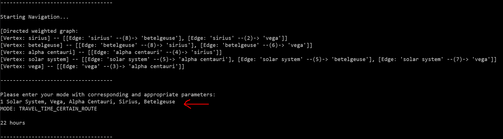

# travel-distance

Personal solution to a traveling problem, to be more specific - graph navigation.

Consisting various modified versions of some _well-known_ searching algorithms.
For example:

- breadth first search
- dijkstra

**Note:** Graph is directed, weighted and possibly cyclic. Self-reference of edges is **not** allowed.

# table of content

- [prerequisite](#prerequisite)
- [how to run](#how-to-run)
  - [docker](#docker)
  - [jar file](#jar-file)
  - [user manual](#user-manual)
- [space highways](#space-highways)
  - [assignment of tasks](#assignment-of-tasks)
    - [general assumptions](#general-assumptions)
    - [sample input](#sample-input)
    - [sample queries](#sample-queries)
- [design explanation](#design-explanation)

# prerequisite

Before you start the program with your desired method [listed below](#how-to-run),
there is one necessary file to create which represents the graph to be created.
Every single line inside the `.graph`-file represents an `edge`, where `vertices` are connected with each other and
a `weight` is given for this specific connection.

An example of a single line:
`firstVertex, secondVertex, 5`

- `firstVertex` is the starting vertex
- `secondVertex` is the ending vertex
- `5` is the weight

For a complete file example, have a look at [`space-highway.graph`](./src/main/resources/space-highway.graph).
Displayed content:

```
Solar System, Alpha Centauri, 5
Solar System, Betelgeuse, 5
Solar System, Vega, 7
Alpha Centauri, Sirius, 4
Betelgeuse, Sirius, 8
Betelgeuse, Vega, 6
Sirius, Betelgeuse, 8
Sirius, Vega, 2
Vega, Alpha Centauri, 3
```

Feel free to construct your own graph, just the mentioned format has to match.

# how to run

There are several ways to run the program, choose a method yourself which suits you.

## docker

To continue further, [prerequisite](#prerequisite) has to be fulfilled.

If you have `docker` installed, just run the image with the following command.

> docker run -it --rm --mount type=bind,source=C:/dev/private-repo/coding-challenge/travel-distance/src/main/resources/space-highway.graph,target=/var/graph-file.graph anjeyy/coding-challenge:travel-distance-latest

The _docker command_ is broken down to multiple parameters:

- `-it` - iterative so that you can use the CLI and give inputs to the program
- `--rm` will remove the container, once the container is **exited**
- `--mount type=bind,source=C:/dev/private-repo/coding-challenge/travel-distance/src/main/resources/space-highway.graph,target=/var/graph-file.graph`
  - with this parameter a single file from your local computer is mounted to the container, which will be _run_
  - `source` - absolute file path from your `.graph` file from [prerequisite](#prerequisite)
  - `destination` - file path inside the _docker container_ - has to be explicitly this target
    since it is referenced inside the [Dockerfile](./Dockerfile) (as a parameter to execute the jar-file)
  - detailed information: https://docs.docker.com/storage/bind-mounts/
  - `anjeyy/coding-challenge:travel-distance-latest` docker image to be pulled

For further and/or detailed information, have a look at the official [docker website](https://docs.docker.com/).

## jar file

To continue further, [prerequisite](#prerequisite) has to be fulfilled.

- download the latest [release](https://github.com/anjeyy/coding-challenge/releases)
- Execute following command to start the program:
  - > java -jar travel-distance-0.01.0.jar C:/dev/private-repo/coding-challenge/travel-distance/src/main/resources/space-highway.graph
  - the last parameter is the _absolute_ file path to the `.graph` file containing the edges of the graph

## user manual

When you successfully launched the program, you will see something like


First it's the initialized graph from your `.graph`-file and the second thing to notice a user input is required.
Depending on the user input various modes will be executed.
There are **five** different modes, all of which are based on the previous input graph.

```text
1 - calculate the time traveled of provided route
2 - find all routes from a starting to an ending vertex with MAXIMUM stops made in between
3 - find all routes from a starting to an ending vertex with EXACT stops made in between
4 - find the shortest path with a starting and ending vertex
5 - find all routes from a starting to an ending vertex with maximum time traveled
```

An example for **mode** `1` as a screenshot.



Highlighted line with a red _arrow_, `1 Solar System, Vega, Alpha Centauri, Sirius, Betelgeuse`.

- first parameter: number `1` indicates the above-mentioned mode
- second parameter: `Solar System, Vega, Alpha Centauri, Sirius, Betelgeuse` is the route for which the travel time shall be calculated
  (**Note:** Ordering is important).

So the abstract concept to mode selection consists of two parameters, where first one is the specific mode to select from,
the second parameter is the input followed **after** the number, which is being parsed.

---

A _format_ overview for different _modes_:

1. > 1 start, first stop, second stop, ..., destination
   1. _Example_: `1 Solar System, Vega, Alpha Centauri, Sirius, Betelgeuse`
2. > 2 start, destination, MAXIMUM stops
   1. _Example_: `2 sirius, sirius, 3`
3. > 3 start, destination, EXACT stops
   1. _Example_: `3 solar system, sirius, 3`
4. > 4 start, destination
   1. _Example_: `4 solar system, sirius`
5. > 5 start, destination, MAX travel time (excluded)
   1. _Example_: `5 sirius, sirius, 30`
   2. `30` means `<= 30`
6. > 6
   1. _Example_: `6`
   2. exits the program and ignores the parameter

# space highways

In the distant future, humankind develops space highways between star systems.
But due to various reasons (like solar winds, asteroid belts and so on), these highways are not always bidirectional,
or sometimes require different travel times in each direction.
For example, travelling from Alpha Centauri to Vega takes 7 hours while the return journey only takes 3.

## assignment of tasks

The purpose of the program you’ll develop is to help spaceship navigators to find their way through space.
Tasks are to compute the travel time of a given route, the number of different routes between two-star systems,
and the shortest route between two-star systems.

You can think of star systems and routes as a directed graph:
star systems are nodes, and the routes between them are _(weighted)_ edges.

### general assumptions

- There will be no more than one way per direction between any two-star systems.
- Space highways always connect different star systems. That is, no space highway will connect a star system to itself.
- For exercises 1—5 [below](#sample-queries): if there is no route, output `NO SUCH ROUTE`.

### sample input

_Star systems_

- Solar System
- Alpha Centauri
- Sirius
- Betelgeuse
- Vega

_Space highways_

- Solar System -> Alpha Centauri: 5 Hours
- Alpha Centauri -> Sirius: 4 Hours
- Sirius -> Betelgeuse: 8 hours
- Betelgeuse -> Sirius: 8 hours
- Betelgeuse -> Vega: 6 hours
- Solar System -> Betelgeuse: 5 hours
- Sirius -> Vega: 2 hours
- Vega -> Alpha Centauri: 3 hours
- Solar System -> Vega: 7 hours

### sample graph


### sample queries

The distance of route:

1. Solar System -> Alpha Centauri -> Sirius - _9 hours_
1. Solar System -> Betelgeuse - _5 hours_
1. Solar System -> Betelgeuse -> Sirius - _13 hours_
1. Solar System -> Vega -> Alpha Centauri -> Sirius -> Betelgeuse -_22 hours_
1. Solar System -> Vega -> Betelgeuse - _NO SUCH ROUTE_
1. Determine all routes starting at Sirius and ending at Sirius with a maximum of 3 stops. Solutions: **2 routes**
   1. Sirius -> Betelgeuse -> Sirius - _(2 stops)_
   1. Sirius -> Vega -> Alpha Centauri -> Sirius - _(3 stops)_
1. Determine the number of routes starting at the solar system and ending at Sirius with exactly 3 stops in between. Solutions: **3 routes**
   1. Solar System -> Alpha Centauri -> Sirius -> Betelgeuse -> Sirius
   1. Solar System -> Betelgeuse -> Sirius -> Betelgeuse -> Sirius
   1. Solar System -> Betelgeuse -> Vega -> Alpha Centauri -> Sirius
1. Determine the duration of the shortest routes (in travel time) between _Solar System_ and _Sirius_. Solution: **9 hours**
1. Determine the duration of the shortest routes (in travel time) starting at _Alpha Centauri_ and ending at A*lpha Centauri*. Solution: **9 hours**
1. Determine all different routes starting at _Sirius_ and ending at _Sirius_ with an over travel time less than 30. Solution: **7 routes**
   1. Sirius -> Betelgeuse -> Sirius
   1. Sirius -> Vega -> Alpha Centauri -> Sirius
   1. Sirius -> Vega -> Alpha Centauri -> Sirius -> Betelgeuse -> Sirius
   1. Sirius -> Betelgeuse -> Sirius -> Vega-> Alpha Centauri -> Sirius
   1. Sirius -> Betelgeuse -> Vega-> Alpha Centauri -> Sirius
   1. Sirius -> Vega -> Alpha Centauri -> Sirius -> Vega -> Alpha Centauri -> Sirius
   1. Sirius -> Vega -> Alpha Centauri -> Sirius -> Vega -> Alpha Centauri -> Sirius -> Vega -> Alpha Centauri -> Sirius

# design explanation

- adjacency list

> todo
